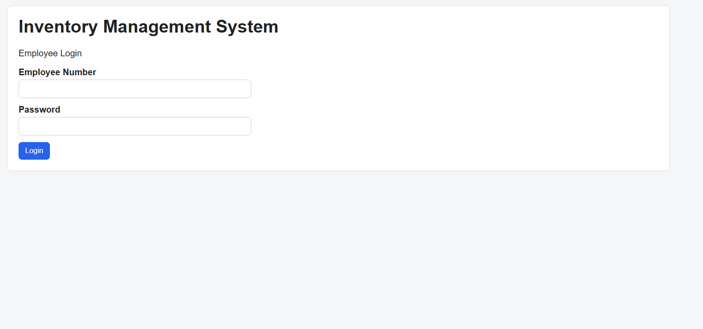
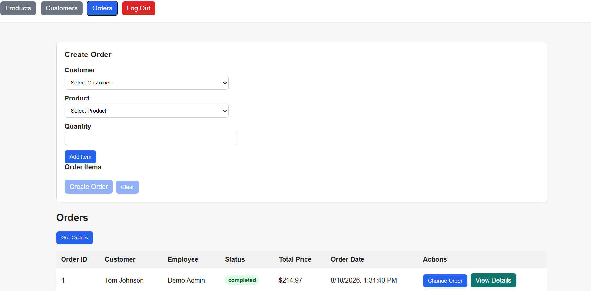

# Inventory Management System

A full-stack Inventory Management System built with **React, Node.js, Express, and PostgreSQL**.

The application allows authenticated employees to manage products, customers, and orders through a secure REST API with JWT authentication and role-based authorization.

## Live Demo

**Live Application:**  
[Open Inventory Management System](inventory-management-system-tau-ten.vercel.app)

### Demo Account

Employee Number: `DEMO001`  
Password: `Demo1234!`

> The demo account has administrator access so reviewers can test product, customer, and order management features.

---

## Features

### Authentication
- JWT authentication
- Password hashing with bcrypt
- Protected frontend routes
- Role-based authorization
- Admin / Manager / Staff roles

### Product Management
- Create products
- View inventory
- Update product information
- Delete products
- Track stock quantity
- Prevent orders that exceed available inventory

### Customer Management
- Create customers
- View customer records
- Update customer information
- Delete customers

### Order Management
- Create multi-product orders
- Add and remove items before order submission
- Validate available stock
- Calculate item totals and estimated order totals
- Update order status
- View detailed order information
- Track the employee responsible for an order

---

## Tech Stack

### Frontend
- React
- React Router
- React Hooks
- Vite
- CSS

### Backend
- Node.js
- Express.js
- REST API
- JWT
- bcrypt

### Database
- PostgreSQL
- Neon (Managed PostgreSQL)

### Deployment
- Vercel — Frontend
- Render — Backend API
- Neon — PostgreSQL database

### Development Tools
- Git
- GitHub
- Thunder Client
- VS Code

---

## Architecture

              User
                │
                ▼
      Vercel (React Frontend)
                │
        HTTPS / REST API
                │
                ▼
    Render (Express Backend)
                │
        PostgreSQL Driver
                │
                ▼
    Neon PostgreSQL Database